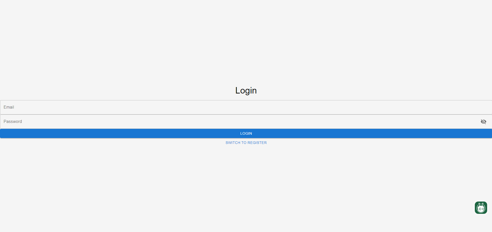
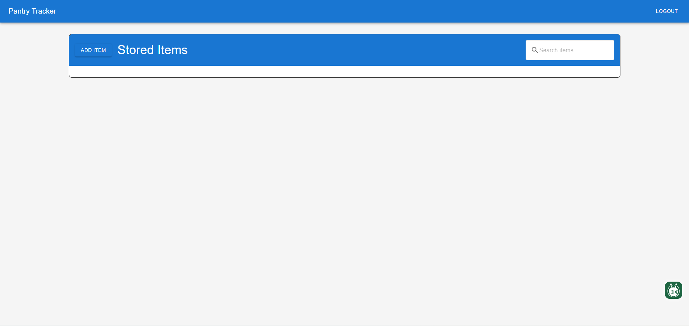
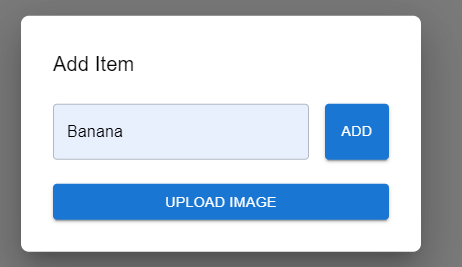
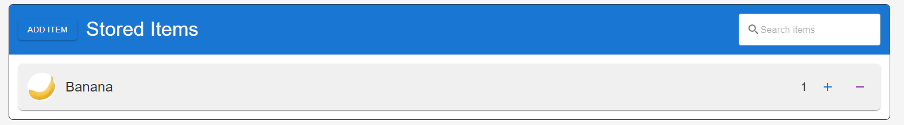

# Inventory Management Tracker

This project is an Inventory Management Tracker, designed to help users keep track of stored items. The application provides a simple and intuitive interface for managing inventory, allowing users to add, view, and manage items.

## Features

### 1. **Login and Registration**
   - The application starts with a Login page where users can enter their credentials to access the inventory management system.
   - New users have the option to switch to the registration form by clicking on "Switch to Register."

   

### 2. **Dashboard**
   - After a successful login, users are directed to the main dashboard.
   - The dashboard provides an overview of the stored items and options to add new items.
   - A search bar is available to quickly find items in the inventory.
   - You are also able to login and sign up if you wish to use a different account.

   

### 3. **Add Item**
   - Users can add new items to the inventory using the "Add Item" button.
   - A pop-up form appears where the user can input the item name.
   - There is also an option to upload an image associated with the item.

   

### 4. **Manage Items**
   - The added items are displayed on the dashboard with the item name and associated image.
   - Users can adjust the quantity of each item by using the "+" and "-" buttons.
   - A search bar allows for easy filtering of items.

   

## Technologies Used

- **Frontend**: React.js, Next.js
- **Backend**: Firebase (Firestore for database, Authentication)
- **Deployment**: Vercel
- **CI/CD**: Vercel CI/CD pipeline for continuous deployment and integration

## Live Demo

Check out the live demo of the application [here](https://inventory-management-red.vercel.app/).

## Contributing

Feel free to fork this repository, create a new branch, and submit a pull request. All contributions are welcome!

## License

This project is licensed under the MIT License. See the `LICENSE` file for details.
